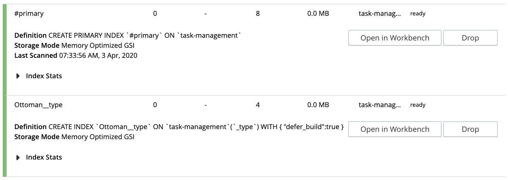
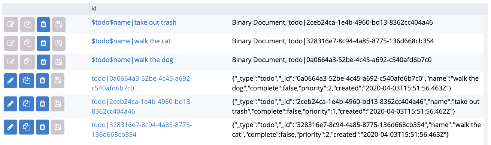

# Getting Started With Ottoman

Currently there is no support for Couchbase Node JS SDK 3, For this reason, we will be installing `couchbase@^2.6`.

First we will need Couchbase Server running, with a bucket named `task-management`. The best way to work with Couchbase Server or any database from a developer environment is to use Docker.

## Build and Run Couchbase Server with Named Bucket

If you have docker installed, we can run the following from the command line:

```sh
docker pull couchbase
```

```sh
git clone https://github.com/httpJunkie/couchbase-server-lt && cd couchbase-server-lt
```

### *Mac Only-

Enable permissions on directory:

```sh
chmod +x configure.sh
```

Build our image:

```sh
docker build -t couchbase-server-lt .
```

Run our Docker containter:

```sh
docker run -d -p 8091-8094:8091-8094 -p 11210:11210 -e CB_ADMIN_USER=Administrator -e CB_ADMIN_PASS=password -e CB_BUCKET=task-management -e CB_BUCKET_PASS= --name cbs1 couchbase-server-lt
```

## Create Documents and Retrieve in Node with Ottoman

Now that we have our database up and running, we just need to create a Node application that with the assistance of Ottoman, we can setup a model for our documents of type "todo" and add them to the bucket and turn around and retrieve a single document.

### Creating the Node JS App

Create a project directory initializing npm and installing `couchbase`, `ottoman`, `dotenv` and, setting up a config and `server.js` file.

```sh
mkdir task-manager && cd $_ && npm init -y && npm install couchbase ottoman dotenv && touch .env && echo -e "user=Administrator \npass=123456 \n" >> .env && touch .server.js
```

Opening the project with your code editor of choice. I am using VS Code, so I can do that from the command line with: `code .`

We created a file named `.env` which we'll use to store our credentials for our database connection. We also created a `server.js` file that we will be adding our code to. In the code samples below, we will add each new section of code one after another. Let's get started building our Ottoman app.

*NOTE: A .env file typically is not uploaded to your git repository. If you have cloned this repo I have kept it part of our repo for your convenience, normally we would have a line in our .`.ignore` file to keep Git from tracking this file*

### Connecting to Couchbase Bucket

Create a connection to our Couchbase Server running in Docker.

```require('dotenv').config()
const { cbUser, cbPass } = process.env

var ottoman = require('ottoman')
var couchbase = require('couchbase')

var cluster = new couchbase.Cluster('couchbase://localhost')

cluster.authenticate(cbUser, cbPass)
ottoman.bucket = cluster.openBucket('task-management')
```

### Creating an Ottoman Model

Create a model that will be our `todo` document. It will get auto-created and stored in our designated `task-management` Couchbase bucket.

```js
var Todo = ottoman.model('todo', {
  name: 'string',
  complete: 'boolean',
  priority: 'integer',
  created: 'Date'
}, {
  index: {
    findByName: {
      by: 'name',
      type: 'refdoc'
    }
  }
});
```

We have used four different types in this model ensuring that we tell Ottoman what kind of data will be stored for each field in our model. As we continue learning we will use more data types and even learn about custom data types that Ottoman supports.

We have also created an index to ensure that we can efficiently retrieve a todo document by name using Couchbase's indexing strategy.

### Create New Documents Using Our Todo Model

Let's populate our bucket with some initial data.

```js
var todo_01 = new Todo({
  name: 'take out trash',
  complete: false,
  priority: 1,
  created: Date.now()
});
var todo_02 = new Todo({
  name: 'walk the dog',
  complete: false,
  priority: 2,
  created: Date.now()
});
var todo_03 = new Todo({
  name: 'walk the cat',
  complete: false,
  priority: 2,
  created: Date.now()
});
```

The created date is added utilizing the [Date.now()](https://developer.mozilla.org/en-US/docs/Web/JavaScript/Reference/Global_Objects/Date/now) JavaScript method and evaluated when we call `.save()` and added to the document for insertion to the bucket in a format like:

```2020-04-02T16:28:20.519Z```

### Save Our Todos

Call Ottoman's `save()` method on each of these objects which will add them to our database so long as no errors occur.

```js
todo_01.save((err) => err
  ? console.error(err)
  : console.info("success: Dragon added!")
);

todo_02.save((err) => err
  ? console.error(err)
  : console.info("success: Dragon added!")
);

todo_03.save((err) => err
  ? console.error(err)
  : console.info("success: Dragon added!")
);
```

With the `save()` methods added, let's run our app. You shold get three success messages in the console and zero errors.

To understand what the save function is doing, let's add one more Todo and log a `console.error()` if an error occurs otherwise a `console.info` if a new Todo is added with success.

```js
new Todo({
  name: 'walk our dragon',
  complete: false,
  priority: 0,
  created: Date.now()
}).save((err) => err
  ? console.error(err)
  : console.info("success: Dragon added!")
);
```

*I condensed the creation of the object and the save into one chunk of code so that it will be easy to delete afterwards. This is just a test document as we do not own a dragon.*

Stop your server (Control + C), and once the above code is added run `node server` again and we will see 3 errors and one success message.

```sh
[CouchbaseError: The key already exists...] {
  message: 'The key already exists...',
  code: 12
}
[CouchbaseError: The key already exists...] {
  message: 'The key already exists...',
  code: 12
}
[CouchbaseError: The key already exists...] {
  message: 'The key already exists...',
  code: 12
}
success: Dragon added!
```

Let's then stop and start our server again and see that we get four errors all of type "Key already exists..." and this is exactly what we should expect as we don't want to duplicate our todo documents. The only thing that has changed is the created date. But Ottoman and Couchbase don't care, because they see that a document of type `todo|name` already exists. The first argument in `ottoman.model()` is the type of the document and combined with `name` create a unique key.

Running `save()` on the same `Todo` with the same `name` will always generate this error, even if we were to change the completed, priority and created values. Try it, play around with this for a few minutes and get a handle on how it works. Change some values and run the server over and over and see what errors arise and how the documents in the database are affected.

Remove the last addition code.

### Ensuring Our Indexes Were Created

One way to see if your indexes were created in Couchbase is to open Couchbase server and navigate to the Indexes tab and see that they were added:



As well look at the documents tab and see the reference documents were also added:



It's great that we can log into our [Couchbase Server web console](localhost:8091) and see that the indexes and reference files were created, but we need a way to check that our indexes and reference documents exist from within our code.

We can do this with the `ottoman.ensureIndicies()` method. This method returns true or false, but for now, we will use a callback that checks for an error, if there is no error, we can do work.

```js
ottoman.ensureIndices(function(err) {
  if (err) {
    console.log('Failed to created indexes and reference docs', err);
    return;
  }
  // do work
  console.log('Created indexes and reference docs!');
});
```

Let's update that code to use our index and lookup we have defined that will allow us to retrieve a particular todo document:

```js
ottoman.ensureIndices(function(err) {
  if (err) {
    console.log('failed to created necessary indices', err);
    return;
  }

  Todo.findByName('take out trash', (err, todo) => {
    if (err) return console.error(err)
    console.log(todo)
  })
});
```
